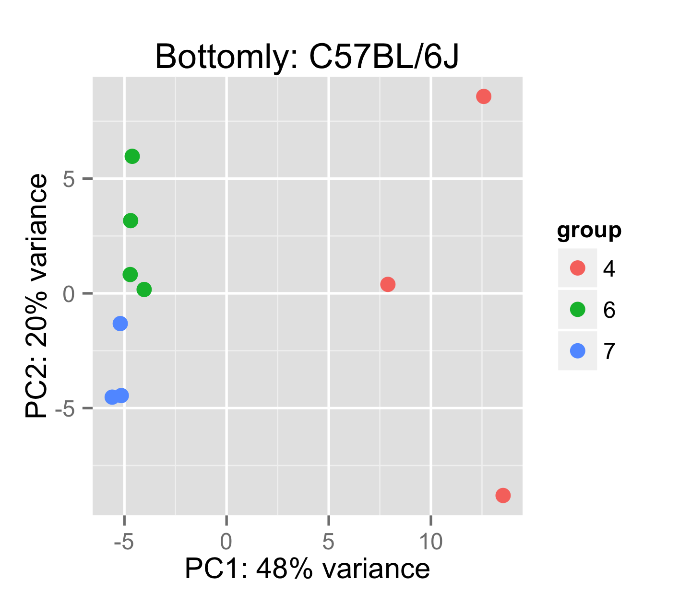
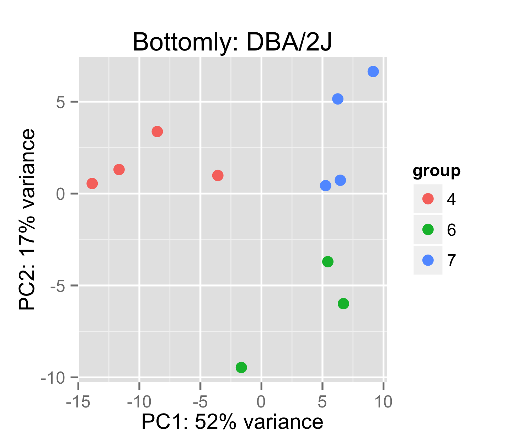
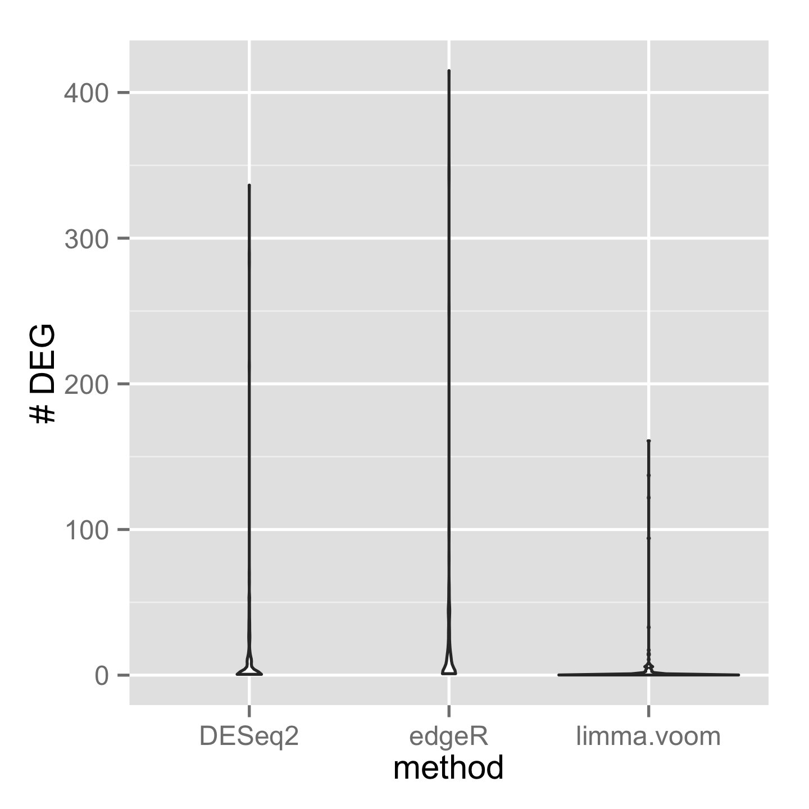

# A closer look at using real data for null simulations

Background and disclaimer: I am one of the authors of the DESeq2
method for differential expression of RNA-seq, which is compared in
the analysis I discuss here. So while I am not at all impartial, I am
familiar with the analysis being done and the potential pitfalls
(in fact we performed a similar analysis in our paper).

**Summary**: Rocke et al (2015) found that DESeq2 and edgeR's false 
positive rates are too high, but this is a result of a flawed analysis
which ignores batch effects among samples from the same
biological condition.

The central analysis in Rocke et al (2015) is a 2 group comparison of random
subsets of RNA-seq samples all from the same biological
condition. Over 100 random replications, the number of genes with p-values
less than alpha (e.g. 10^-4) is summed up over replications
and compared to the number expected under
the null hypothesis, which is (# of genes) x (# of simulations) x alpha.

Methods are then compared based on how far their sum of small p-values
exceeded the expected number, and this is supposed to be a measure 
of their false positive rare (Type I error).

The issues I take with the analysis are: 

1. relying on a skewed summary statistic (the sum)
2. confounding experimental batches with the comparison of interest.

The simulation in Rocke et al relies on the assumption that the
samples within one biological condition are independent. 
However, **independence is clearly not the case for all of the datasets examined**.
If we take as example the experimental data of Bottomly et al, prepared by the
ReCount project, there are strong correlations within the experimental
batches. We can see this with a PCA plot of top 500 genes by total variance
(PCA of log counts corrected for sequencing depth).

When one of the random replications picks three samples from one
batch and three samples from another batch, a sensitive method will find differences.
Even though the samples are all in the same biological condition,
we know from a simple diagnostic plot that
there are systematic differences in counts associated with experimental batch.
It has been shown many times, that when batch effects are
confounded with comparisons of interest, a naive analysis
will produce spurious positives in high-throughput genomic datasets,
for examples. see [Leek et al 2010](http://www.ncbi.nlm.nih.gov/pmc/articles/PMC3880143/).

If we then *sum* the number of genes with small p-values (here, p < 10^-4)
from all replications,
the genes with small p-values from the replications which were confounded with batch
will skew the total, even if there are many other replications
with 0 genes with small p-values.
If we look at the *distribution* instead of the *sum* or the *mean* of
the number of genes with small p-values, we see that the distribution
is quite skewed for DESeq2, edgeR and limma+voom.
The mean is not a good summary statistic for this data.

If we examine the samples for which DESeq2 had the most
calls, we see that these are in fact exactly those replications which were
confounded with batch. It is important here to note: these are not false
positives. **We should not fault a method for finding difference
in measured values, when those differences are due to batch effect.**
Instead, we should always balance batch across the comparison of interest
during experimental design, and include batch variables in the model matrix
during statistical analysis.

|comparison         |number of DEG |
|:------------------|:-------------|
|[6 7 7] vs [4 4 4] |337           |
|[4 4 4] vs [6 6 7] |289           |
|[4 4 4] vs [6 6 7] |283           |
|[6 6 7] vs [4 4 4] |212           |
|[7 7 7] vs [4 4 6] |70            |
|[6 7 7] vs [4 4 6] |64            |
|[4 4 6] vs [6 6 7] |53            |
|[6 6 7] vs [4 4 6] |53            |
|[6 6 7] vs [4 4 6] |53            |
|[6 7 7] vs [4 4 6] |48            |

If we use a more reasonable summary statistic, such as the median, then
we can see that the number of p-values less than 10^-4 for a typical
replication is not as high as suggested by the mean or the sum.

|    DESeq2  |    edgeR   |  limma.voom  |   nonzero    |
|:-----------|:-----------|:-------------|:-------------|
|Min.   :  0 |Min.   :  0 |Min.   :  0.0 |Min.   :11153 |
|1st Qu.:  0 |1st Qu.:  1 |1st Qu.:  0.0 |1st Qu.:11159 |
|Median :  1 |Median :  4 |Median :  0.0 |Median :11161 |
|Mean   : 12 |Mean   : 18 |Mean   :  3.9 |Mean   :11161 |
|3rd Qu.:  9 |3rd Qu.: 15 |3rd Qu.:  1.0 |3rd Qu.:11163 |
|Max.   :337 |Max.   :416 |Max.   :161.0 |Max.   :11167 |

Note that the expected number of p-values less than 10^-4 here would
be around 1.1.

I am not claiming that our method or other methods always exactly
control Type 1 error, and I want to reaffirm that benchmarks are
important and useful.  In our paper, where we looked at precision
using the Bottomly data, we balanced the experimental batches across
comparisons using data-splitting functions in the [caret](http://topepo.github.io/caret/index.html)
package.  We found that DESeq2 had a range of precision, but that this
range was around the target value.
[Benidt and Nettleton 2015](http://dx.doi.org/10.1093/bioinformatics/btv124)
create a nonparametric simulation using the Bottomly dataset, and find
that parametric methods somewhat exceed the FDR, for example, for a
target FDR of 10%, the achieved FDR might be be 15% or 20%, although
this analysis also did not apparently control for batch effects.

My point is that (1) the sum is not a good summary statistic for these kinds of
analyses, and plots which show the full range of the results
are far better at revealing the performance of methods here;
and (2) that experimental batch should taken into consideration when
one is trying to use real data to model a null hypothesis situation.

Improving methods requires an iterative process of methods development and benchmarking
work, incorporating the good parts from various methods to improve
performance. For this, we need good methods and good benchmarks.

This repo contains all the code used to generate these figures and tables.

* `simulation.R` : contains the scripts for generating p-values
* `tables_and_figures.Rnw` : contains the code for making figures

Footnote: I attempted to draw the attention of the authors to this issue before
publication with a simple simulation, which showed loss of Type I error
control even for the basic t-test when ignoring batch effects.

<https://twitter.com/mikelove/status/525016601004081152>

